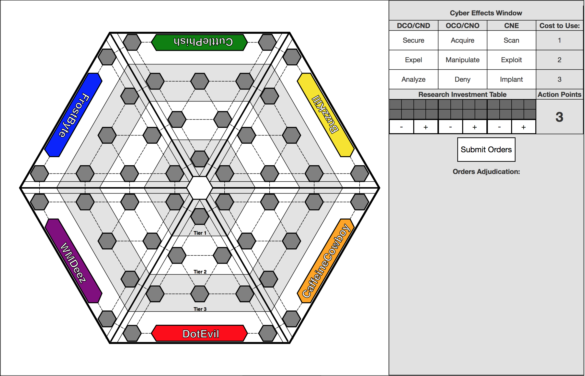
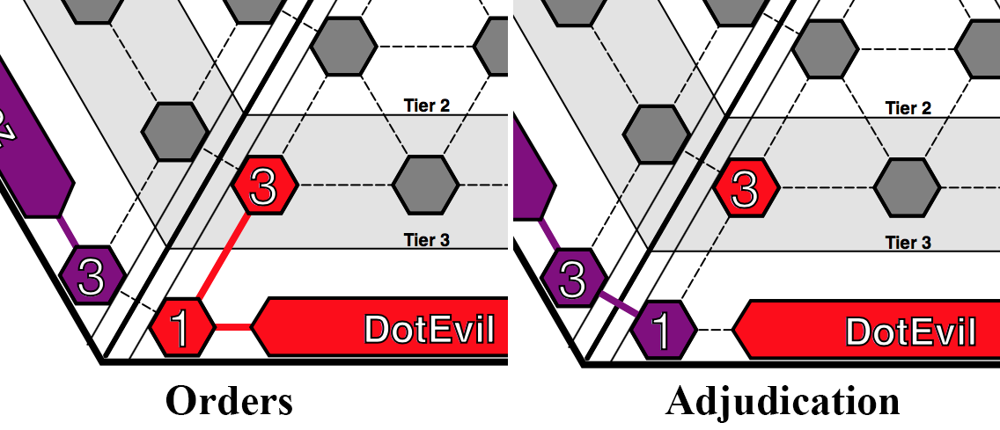
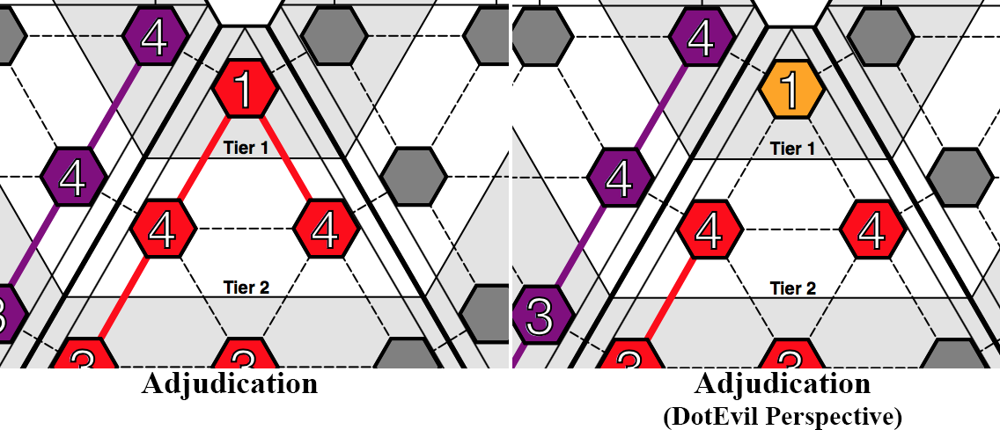
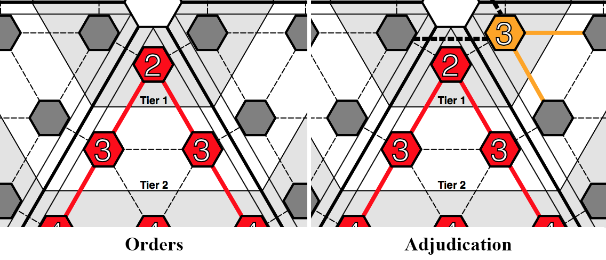
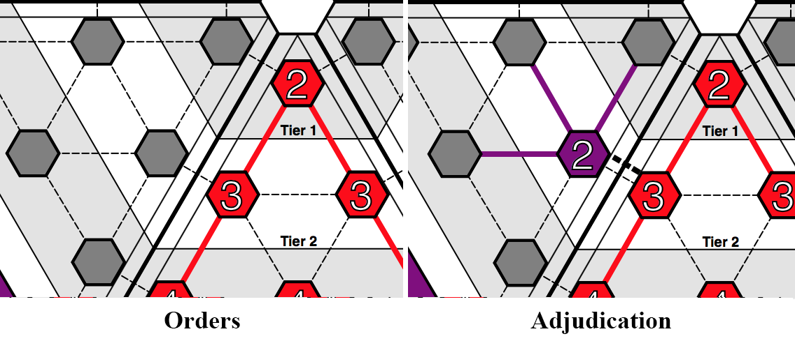
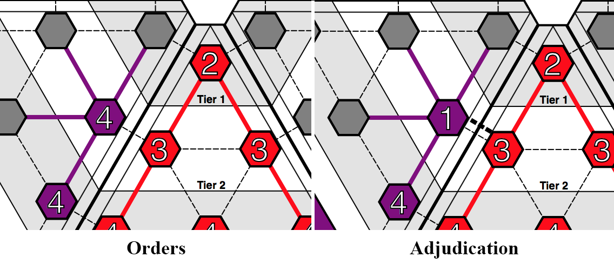
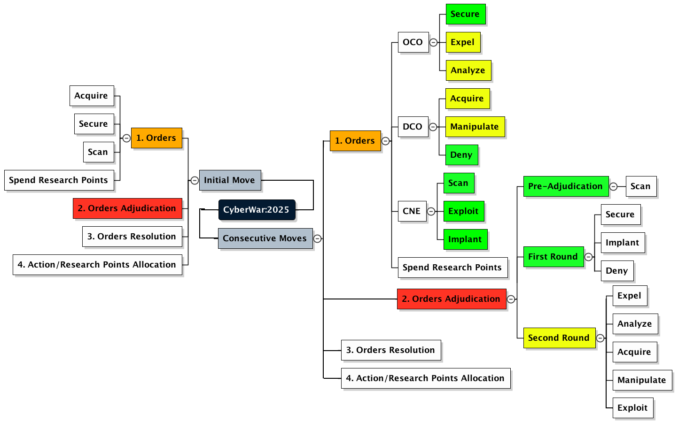

# CyberWar:2025 — NPS Thesis/Capstone Project

> A multi-player cyber themed educational interactive wargame. Designed and developed at Naval Postgraduate School.
> Graduation date: December 2017.

### Install Dependencies

We have two kinds of dependencies in this project: tools and Angular framework code. The tools help
us manage and test the application.

* We get the tools we depend upon via `npm`, the [Node package manager][npm].
* We get the Angular code via `bower`, a [client-side code package manager][bower].
* In order to run the end-to-end tests, you will also need to have the
  [Java Development Kit (JDK)][jdk] installed on your machine. Check out the section on
  [end-to-end testing](#e2e-testing) for more info.

We have preconfigured `npm` to automatically run `bower` so we can simply do:

```
npm install
```

Behind the scenes this will also call `bower install`. After that, you should find out that you have
two new folders in your project.

* `node_modules` - contains the npm packages for the tools needed
* `bower_components` - is not used in this project

### Run the Application

We have preconfigured the project with a simple development web server. The simplest way to start
this server is:

```
npm start
```

Now browse to the app at [`localhost:8080/`][local-app-url].


## Directory Layout

```
client/                 --> all source files for the client view
    audio/                  --> game audio and sfx (not implemented yet)
    css/                    --> default stylesheets
    fonts/                  --> game fonts (not implemented yet)
    html/                   --> the index.html entry for the game board
    img/                    --> background images that were designed for the game but not used (yet)
    js/                     --> client view specific source files
        canvas/                 --> source files for the Konva "Canvas" Layer Objects 
            [dirs]                  --> specific player/domain source files using Konva library 
            mainKonvaStage.js       --> the main stage for the Konva "Canvas" library
        conroller/
            canvasCtrl.js       --> the main controller that was used to test modal actions with Konva objects.
            main.js             --> unused (at this time)
            modalInstance.js    --> copy/paste code for modal testing
            uiCtrl.js           --> for the user interaction area on the right side of the board
        directive/
            exploitLinks/
            overtLinks/
            serverDomain/
documentation/          --> documentation and supported files only
server/                 --> all source files for the game server (not implemented yet)
shared/                 --> shared game objects, references, and libraries
karma.conf.js         --> config file for running unit tests with Karma
e2e-tests/            --> end-to-end tests
  protractor-conf.js    --> Protractor config file
  scenarios.js          --> end-to-end scenarios to be run by Protractor
```


## Build Setup

```
# install dependencies
npm install

# serve with hot reload at localhost:8080
npm run dev

# build for production with minification
npm run build

# build for production and view the bundle analyzer report
npm run build --report

# run unit tests
npm run unit

# run all tests
npm test
```

## Updating Angular

Since the Angular framework library code and tools are acquired through package managers (npm and
bower) you can use these tools to easily update the dependencies. Simply run the preconfigured
script:

```
npm run update-deps
```

This will call `npm update` and `bower update`, which in turn will find and install the latest
versions that match the version ranges specified in the `package.json` and `bower.json` files
respectively.

# CyberWar:2025 Game Specific Development Documentation
## Board Layout

## Konva Object Naming Conventions
Using the Red Domain (a.k.a. "DotEvil") as an example:
  - Red Base = `rBase`
  - Red Server Nodes = r[#]Hex (e.g. `r1Hex`, `r2Hex`,..., `r8Hex`)
  - Red Primary/Overt Links:
    - Red Base = `rBaseToR1Hex` & `rBaseToR2Hex`
    - Red Server Nodes = `r1HexToR3Hex`, `r2HexToR5Hex`, etc.
  - Red Exploit/Covert Links:
    - Red Base: `r1rBaseExploit` & `r2rBaseExploit`
    - Red Server Nodes = `r1r3Exploit`, `r2r5Exploit`, etc.
    
Inter-Domain Link Naming Conventions:
  Again these are named in a clockwise fashion.
  So with Red ("DotEvil") to Purple ("WMDeez") the Primary/Overt links are:
  Tier 4: `R1HexP2Hex`
  Tier 3: `R3HexP5Hex`
  Tier 2: `R6HexP7Hex`
  Tier 1: `R8HexP8Hex` (Note: In this case Red and Purple are near neighbors)


  Exploit/Covert links are slightly different:
  Tier 4: `r1p2Exploit`
  Tier 3: `r3p5Exploit`
  Tier 2: `r6p7Exploit`
  Tier 1: `r8p8Exploit`
  (There is reason why lower case was used here, it just is. However, it can be changed fairly easily.)

### Konva Object Flow
The order of movement around the board is clockwise (e.g. `Red -> Purple -> Blue -> Green -> Yellow -> Orange -> Red`).
This applies for inter-domain primary and exploit links. The only confusion is in the center of Tier 1
  where a player has to skip past their near-domain neighbor three other far domains.
  For example, when "Red8Hex" has to cross to "Blue8Hex", "Green8Hex", and "Yellow8Hex" directly
  the primary/exploit links do not go through Purple or Orange.

Naming convention order of movement in a player domain goes from Tier 4 (`rBase`, `r1Hex`, & `r2Hex`)
  up to Tier 3 and then inward to the center. From there it goes to Tier 2, then Tier 1.
```  
            ->[Node8]<-                 #Tier 1
           |           |
        ->[Node6]-->[Node7]<-           #Tier 2
       |       ^     ^       |
       |        \   /        |
   ->[Node3]-->[Node4]<--[Node5]<-      #Tier 3
  |                               |
[Node1]<--------[Base]-------->[Node2]  #Tier 4
```

Tier 8 inter-domain links are a lot more complicated since from `o8Hex`<-`r8Hex`->`p8Hex` are near domain neighbors, but 
`r8Hex`->`b8Hex`, `r8Hex`->`g8Hex`,`r8Hex`->`y8Hex` are distant domains. 

## Cyber Effects 
#### Defensive Cyberspace Operations (DCO)
##### Secure
The Secure cyber effect is the base action for all defensive operations. 
Secure hardens the player's server node by increasing its defensive value against attacks. 
This defensive value is also used as the attack value when launching OCO and CNE cyber effects on other players. 

##### Expel
Expel is a level-two cyber effect that removes any covertly hidden, or exploiting, 
players that reside on your overtly controlled server nodes. 
Expel can also be used by exploiting players to remove other players as well as the player overtly controlling 
that server node; however, successful adjudication using Expel from a player who is covertly on that server node 
will reduce defensive level of that server node to the base value of one. 

##### Analyze
Analyze is the highest level cyber effect in the DCO table. 
Analyze is a similar but more effective version of the CNE Scan cyber effect because it can scan the player's entire 
network of linked server nodes to reveal any exploited players residing on the player's network. 
Analyze also can attribute Manipulate cyber effects to the launching attacker.


#### Offensive Cyberspace Operations (OCO)
##### Acquire
The Acquire cyber effect is the base action for all offensive operations. 
Acquire captures adjacent server nodes on the map. If the nearby server node is unoccupied, 
acquire automatically captures that server node for the player. However, if the adjacent server node is occupied 
by another player then the defensive value from the player's launching server node and the defending player's 
server node are factored together, along with the dice roll (see Niels' Method), 
to adjudicate who controls the contested server node. Players who lost in defending against an acquire attack 
in their own local domain can see which player attacked them; however, if a defending player's 
server node is lost outside their local domain then that server node is displayed as neutral server node. 
Attacking players cannot acquire opposing player bases.

##### Manipulate
Manipulate is a level-two cyber effect that is similar to the level-one Acquire effect. 
The only difference with Manipulate is that, if successful in adjudication and in the defending player's local domain, 
the attacking player can misattribute the acquire action launched and deceive the 
defending player as another player on the board. 

##### Deny
Deny is the highest level cyber effect in the OCO table and is a permanent cyber effect 
which renders the attacked server node as unusable for all players for the remainder of the game. 
Deny essentially destroys that server node on the map and further restricts player movement on the board.

##### Scan
The Scan cyber effect is the base action for all exploitation operations. 
Scan is a reconnaissance effect that identifies adjacent server nodes' defensive value 
as well as any overt and covert links that are established to and from that server node. 
Scan can be used internally of the player's domain to identify localized threats as well as externally 
of the player's domain when strategizing consecutive moves. 

##### Exploit
Exploit is a level-two cyber effect that is similar to the level-one Acquire effect in the OCO table except 
that Exploit is a covert acquire, therefore the action is not revealed to the defending player. 
There can be several exploiting players "stacked" on one server node and the identities of these 
players are not revealed until either a Scan or Analyze effect has been launched by a player. 
Players on exploited server nodes can also launch overt cyber effects, but the attacking value is 
either the overt value of that server node or one, if not overtly controlled. 
Attacking players cannot exploit opposing player bases. 

##### Implant
Implant is the highest level cyber effect in the CNE table. 
Implant has two separate effects depending on if it is launched on a regular server node or an opposing player's base. 
If launched on a regular server node, then the defensive value of that server node is reduced to one 
and then the attacking player can stack, or conjunctively launch, another OCO or CNE effect to gain access 
to that server node. If Implant is launched on a base, then the effect resembles that of a ransomware attack 
on the defending player. When is implanted with the ransomware, the defending player is effectively locked out 
of their network and can only attempt to remove the ransomware by expelling it from their base, 
if Expel has been researched and if the player has enough action/research points to launch the cyber effects. 
The ransomware effect only lasts five rounds and after those five rounds have passed, the defending player 
will be free of the ransomware attack and can continue play. Otherwise the defending player either has to pay out 
their total amount of action/research points from server nodes they own to be free of the ransomware. 
Also, attacking players cannot acquire opposing player bases.


## Game Flow and Adjudication
In the initial round, players are all given 3 Action/Research Points to either acquire, defend, or invest in research.
After the initial round, players are given the an amount of Action/Research Points based off their 
positively linked and controlled server nodes, this includes exlploited server nodes as well.

The game flow is simultaneous turn-based where all orders are adjudicated at the same time. The adjudication process
is slightly offset based on which cyber effect is used. For the most part Scan, Secure, Implant, and Deny are the only
cyber effects that need to be adjudicated first because they have a strong effect on other orders being executed in the
iteration. However, if Implant or Deny fail then any orders that are taking place on the same server node will be
adjudicated normally and as is.


[angularjs]: https://angularjs.org/
[bower]: http://bower.io/
[git]: https://git-scm.com/
[http-server]: https://github.com/indexzero/http-server
[jasmine]: https://jasmine.github.io/
[jdk]: https://wikipedia.org/wiki/Java_Development_Kit
[jdk-download]: http://www.oracle.com/technetwork/java/javase/downloads
[karma]: https://karma-runner.github.io/
[local-app-url]: http://localhost:8000/
[node]: https://nodejs.org/
[npm]: https://www.npmjs.org/
[protractor]: http://www.protractortest.org/
[selenium]: http://docs.seleniumhq.org/
[travis]: https://travis-ci.org/
[travis-docs]: https://docs.travis-ci.com/user/getting-started
[konva]: https://konvajs.github.io/
