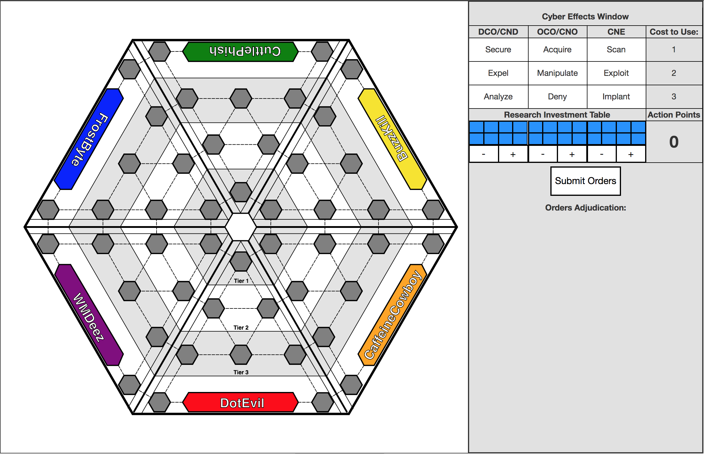
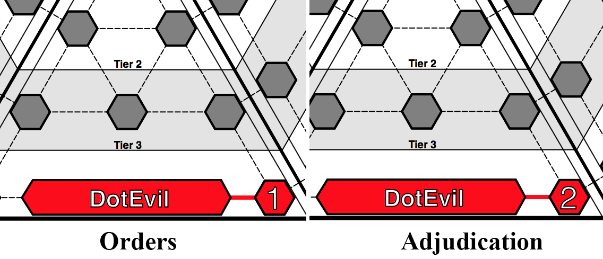
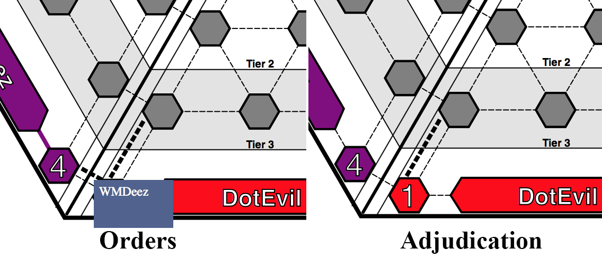
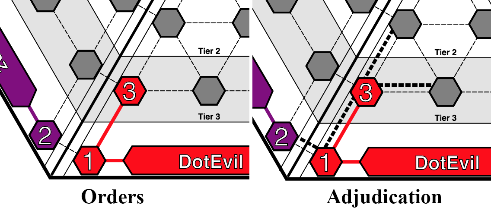

# CyberWar:2025 — NPS Thesis/Capstone Project

> A cyber themed educational wargame. Designed and developed at Naval Postgraduate School (Grad: December 2017).

### Install Dependencies

We have two kinds of dependencies in this project: tools and Angular framework code. The tools help
us manage and test the application.

* We get the tools we depend upon via `npm`, the [Node package manager][npm].
* We get the Angular code via `bower`, a [client-side code package manager][bower].
* In order to run the end-to-end tests, you will also need to have the
  [Java Development Kit (JDK)][jdk] installed on your machine. Check out the section on
  [end-to-end testing](#e2e-testing) for more info.

We have preconfigured `npm` to automatically run `bower` so we can simply do:

```
npm install
```

Behind the scenes this will also call `bower install`. After that, you should find out that you have
two new folders in your project.

* `node_modules` - contains the npm packages for the tools we need
* `app/bower_components` - contains the Angular framework files

### Run the Application

We have preconfigured the project with a simple development web server. The simplest way to start
this server is:

```
npm start
```

Now browse to the app at [`localhost:8080/index.html`][local-app-url].


## Directory Layout

```
app/                    --> UNUSED
client/                 --> all source files for the client view
    audio/                  --> game audio and sfx (not implemented yet)
    css/                    --> default stylesheets
    fonts/                  --> game fonts (not implemented yet)
    html/                   --> the index.html entry for the game board
    img/                    --> background images that were designed for the game but not used (yet)
    js/                     --> client view specific source files
        canvas/                 --> source files for the Konva "Canvas" Layer Objects 
            [dirs]                  --> specific player/domain source files using Konva library 
            mainKonvaStage.js       --> the main stage for the Konva "Canvas" library
        conroller/
            canvasCtrl.js       --> the main controller that was used to test modal actions with Konva objects.
            main.js             --> unused (at this time)
            modalInstance.js    --> copy/paste code for modal testing
            uiCtrl.js           --> for the user interaction area on the right side of the board
        directive/
            exploitLinks/
            overtLinks/
            serverDomain/
documentation/          --> documentation and supported files only
server/                 --> all source files for the game server (not implemented yet)
shared/                 --> shared game objects, references, and libraries
karma.conf.js         --> config file for running unit tests with Karma
e2e-tests/            --> end-to-end tests
  protractor-conf.js    --> Protractor config file
  scenarios.js          --> end-to-end scenarios to be run by Protractor
```


## Build Setup

```
# install dependencies
npm install

# serve with hot reload at localhost:8080
npm run dev

# build for production with minification
npm run build

# build for production and view the bundle analyzer report
npm run build --report

# run unit tests
npm run unit

# run all tests
npm test
```

## Updating Angular

Since the Angular framework library code and tools are acquired through package managers (npm and
bower) you can use these tools to easily update the dependencies. Simply run the preconfigured
script:

```
npm run update-deps
```

This will call `npm update` and `bower update`, which in turn will find and install the latest
versions that match the version ranges specified in the `package.json` and `bower.json` files
respectively.

## Serving the Application Files

While Angular is client-side-only technology and it is possible to create Angular web apps that
do not require a backend server at all, we recommend serving the project files using a local
web server during development to avoid issues with security restrictions (sandbox) in browsers. The
sandbox implementation varies between browsers, but quite often prevents things like cookies, XHR,
etc to function properly when an HTML page is opened via the `file://` scheme instead of `http://`.

### Running the App during Development

`CyberWar:2025` comes preconfigured with a local development web server. It is a Node.js
tool called [http-server][http-server]. You can start this web server with `npm start`.

Alternatively, you can choose to configure your own web server, such as Apache or Nginx. Just
configure your server to serve the files under the `app/` directory.


# CyberWar:2025 Game Specific Development Documentation
## Board Layout

## Konva Object Naming Conventions
## Konva Object Flow
## Cyber Effects
### DCO
#### Secure

#### Expel

#### Analyze



[angularjs]: https://angularjs.org/
[bower]: http://bower.io/
[git]: https://git-scm.com/
[http-server]: https://github.com/indexzero/http-server
[jasmine]: https://jasmine.github.io/
[jdk]: https://wikipedia.org/wiki/Java_Development_Kit
[jdk-download]: http://www.oracle.com/technetwork/java/javase/downloads
[karma]: https://karma-runner.github.io/
[local-app-url]: http://localhost:8000/index.html
[node]: https://nodejs.org/
[npm]: https://www.npmjs.org/
[protractor]: http://www.protractortest.org/
[selenium]: http://docs.seleniumhq.org/
[travis]: https://travis-ci.org/
[travis-docs]: https://docs.travis-ci.com/user/getting-started
[konva]: https://konvajs.github.io/
