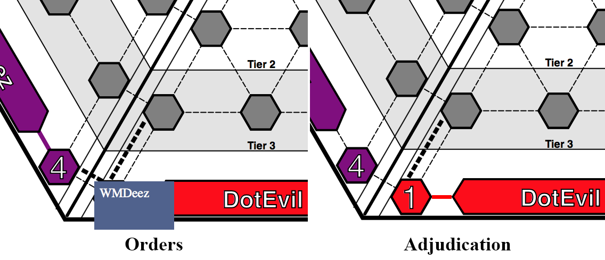

# CyberWar:2025 — NPS Thesis/Capstone Project

> A multi-player cyber themed educational interactive wargame. Designed and developed at Naval Postgraduate School.
> Graduation date: December 2017.

### Install Dependencies

We have two kinds of dependencies in this project: tools and Angular framework code. The tools help
us manage and test the application.

* We get the tools we depend upon via `npm`, the [Node package manager][npm].
* We get the Angular code via `bower`, a [client-side code package manager][bower].
* In order to run the end-to-end tests, you will also need to have the
  [Java Development Kit (JDK)][jdk] installed on your machine. Check out the section on
  [end-to-end testing](#e2e-testing) for more info.

We have preconfigured `npm` to automatically run `bower` so we can simply do:

```
npm install
```

Behind the scenes this will also call `bower install`. After that, you should find out that you have
two new folders in your project.

* `node_modules` - contains the npm packages for the tools we need
* `app/bower_components` - contains the Angular framework files

### Run the Application

We have preconfigured the project with a simple development web server. The simplest way to start
this server is:

```
npm start
```

Now browse to the app at [`localhost:8080/index.html`][local-app-url].


## Directory Layout

```
client/                 --> all source files for the client view
    audio/                  --> game audio and sfx (not implemented yet)
    css/                    --> default stylesheets
    fonts/                  --> game fonts (not implemented yet)
    html/                   --> the index.html entry for the game board
    img/                    --> background images that were designed for the game but not used (yet)
    js/                     --> client view specific source files
        canvas/                 --> source files for the Konva "Canvas" Layer Objects 
            [dirs]                  --> specific player/domain source files using Konva library 
            mainKonvaStage.js       --> the main stage for the Konva "Canvas" library
        conroller/
            canvasCtrl.js       --> the main controller that was used to test modal actions with Konva objects.
            main.js             --> unused (at this time)
            modalInstance.js    --> copy/paste code for modal testing
            uiCtrl.js           --> for the user interaction area on the right side of the board
        directive/
            exploitLinks/
            overtLinks/
            serverDomain/
documentation/          --> documentation and supported files only
server/                 --> all source files for the game server (not implemented yet)
shared/                 --> shared game objects, references, and libraries
karma.conf.js         --> config file for running unit tests with Karma
e2e-tests/            --> end-to-end tests
  protractor-conf.js    --> Protractor config file
  scenarios.js          --> end-to-end scenarios to be run by Protractor
```


## Build Setup

```
# install dependencies
npm install

# serve with hot reload at localhost:8080
npm run dev

# build for production with minification
npm run build

# build for production and view the bundle analyzer report
npm run build --report

# run unit tests
npm run unit

# run all tests
npm test
```

## Updating Angular

Since the Angular framework library code and tools are acquired through package managers (npm and
bower) you can use these tools to easily update the dependencies. Simply run the preconfigured
script:

```
npm run update-deps
```

This will call `npm update` and `bower update`, which in turn will find and install the latest
versions that match the version ranges specified in the `package.json` and `bower.json` files
respectively.

# CyberWar:2025 Game Specific Development Documentation
## Board Layout

## Konva Object Naming Conventions
Using the Red Domain (a.k.a. "DotEvil") as an example:
  - Red Base = rBase
  - Red Server Nodes = r[#]Hex (e.g. r1Hex, r2Hex,..., r8Hex)
  - Red Primary/Overt Links:
    - Red Base = rBaseToR1Hex & rBaseToR2Hex
    - Red Server Nodes = r1HexToR3Hex, r2HexToR5Hex, etc.
  - Red Exploit/Covert Links:
    - Red Base: r1rBaseExploit & r2rBaseExploit
    - Red Server Nodes = r1r3Exploit, r2r5Exploit, etc.

    PLEASE NOTE:
    Naming convention order of movement in a player domain goes from Tier 4 (Base, r1Hex, & r2Hex)
      up to Tier 3 and then inward to the center. From there it goes to Tier 2, then Tier 1.
    ```  
                ->[Node8]<-                 #Tier 1
               |           |
            ->[Node6]-->[Node7]<-           #Tier 2
           |       ^     ^       |
           |        \   /        |
       ->[Node3]-->[Node4]<--[Node5]<-      #Tier 3
      |                               |
    [Node1]<--------[Base]-------->[Node2]  #Tier 4
    ```

    The order of movement around the board is clockwise (e.g. Red -> Purple -> Blue -> Green -> Yellow -> Orange -> Red).
    This applies for inter-domain primary and exploit links. The only confusion is in the center of Tier 1
      where a player has to skip past their near-domain neighbor three other far domains.
      For example, when "Red8Hex" has to cross to "Blue8Hex", "Green8Hex", and "Yellow8Hex" directly
      the primary/exploit links do not go through Purple or Orange.

Inter-Domain Link Naming Conventions:
  Again these are named in a clockwise fashion.
  So with Red ("DotEvil") to Purple ("WMDeez") the Primary/Overt links are:
  Tier 4: R1HexP2Hex
  Tier 3: R3HexP5Hex
  Tier 2: R6HexP7Hex
  Tier 1: R8HexP8Hex (Note: In this case Red and Purple are near neighbors)


  Exploit/Covert links are slightly different:
  Tier 4: r1p2Exploit
  Tier 3: r3p5Exploit
  Tier 2: r6p7Exploit
  Tier 1: r8p8Exploit
  (There is reason why lower case was used here, it just is. However, it can be changed fairly easily.)
## Konva Object Flow
## Cyber Effects 
#### Defensive Cyberspace Operations (DCO)
##### Secure

##### Expel

##### Analyze


#### Offensive Cyberspace Operations (OCO)
##### Acquire

##### Manipulate

##### Deny


[angularjs]: https://angularjs.org/
[bower]: http://bower.io/
[git]: https://git-scm.com/
[http-server]: https://github.com/indexzero/http-server
[jasmine]: https://jasmine.github.io/
[jdk]: https://wikipedia.org/wiki/Java_Development_Kit
[jdk-download]: http://www.oracle.com/technetwork/java/javase/downloads
[karma]: https://karma-runner.github.io/
[local-app-url]: http://localhost:8000/index.html
[node]: https://nodejs.org/
[npm]: https://www.npmjs.org/
[protractor]: http://www.protractortest.org/
[selenium]: http://docs.seleniumhq.org/
[travis]: https://travis-ci.org/
[travis-docs]: https://docs.travis-ci.com/user/getting-started
[konva]: https://konvajs.github.io/
